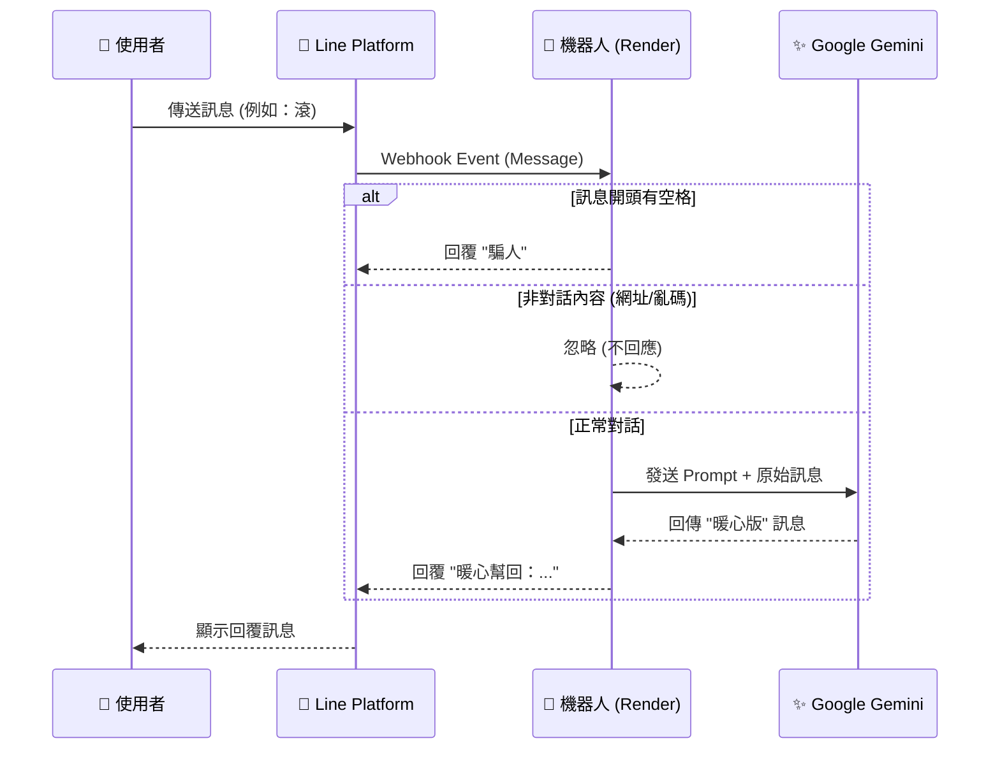

# Line Bot - 溫暖對話翻譯機 (Warm Translator)

這是一個結合 Google Gemini AI 的 Line 機器人，專門用來將對話中的語氣轉換得更溫暖、更有禮貌。它可以加入群組或個人聊天室，自動偵測並「潤飾」對話。

## 📖 專案緣起 (Original Prompt)

本專案源自於以下需求：

> 幫我規劃一個line機器人 可以加入聊天室
> 功能為 幫忙把對話轉成溫暖的表達
> 譬如
> 老婆: 要回來了沒! 幾點了
> 機器人: 有點晚了, 你回來要小心
>
> 媽媽: 晚上要回家吃飯嗎
> 小孩:不
> 機器人: 不會喔, 我吃完再回去, 不用準備我的了, 謝謝

## 🌟 功能特色

1.  **AI 溫暖改寫**：使用 Google Gemini (`models/gemini-3-flash-preview`) 將輸入文字改寫為繁體中文的暖心回覆。
2.  **自動過濾**：
    *   自動忽略非對話內容 (如網址、亂碼、程式碼)。
    *   若判定無須回應，機器人會保持安靜。
3.  **特殊規則**：
    *   若訊息**開頭為空格** (例如 ` 測試`)，機器人會強制回應：「**騙人**」。
4.  **固定格式**：所有 AI 回應皆會加上前綴 `暖心幫回：`。

## 🔄 運作流程 (Workflow)



## 🛠️ 技術架構 (Tech Stack)

本專案使用以下技術構建，追求極簡與高效：

*   **程式語言**: Python 3
*   **Web 框架**: Flask (輕量級 Web 介面)
*   **通訊協定**: Line Messaging API (SDK)
*   **核心 AI**: Google GenAI SDK (Gemini 3 Flash Preview)
*   **部署平台**: Render (Gunicorn Server)

## 📊 程式碼規模 (Code Stats)

令人驚豔的是，這個具備 AI 判斷、自動過濾、串接通訊軟體的完整應用，**僅用了約 120 行程式碼** 就完成了！

*   **核心邏輯 (`bot_logic.py`)**: 約 60 行 (包含 Prompt 與特殊規則)
*   **伺服器端 (`app.py`)**: 約 60 行 (包含 Webhook 驗證與路由)

這展現了現代 AI SDK 與 Python 生態系的強大生產力。

## �🚀 部署教學 (Deployment Guide)

本專案設計為免費部署於 **Render.com**。

### 第一步：取得 Line 金鑰
1. 登入 [Line Developers Console](https://developers.line.biz/console/)。
2. 建立一個 **Messaging API** 頻道 (Channel)。
3. 取得以下兩組資料：
    *   **Channel Secret**: 在 `Basic settings` 分頁下方。
    *   **Channel Access Token**: 在 `Messaging API` 分頁最下方 (需按 Issue)。

### 第二步：Render 部署設定
1. 註冊/登入 [Render.com](https://render.com)。
2. 新增 **Web Service**，連結本 GitHub Repository。
3. 設定參數：
    *   **Runtime**: `Python 3`
    *   **Build Command**: `pip install -r requirements.txt`
    *   **Start Command**: `gunicorn app:app`
    *   **Instance Type**: `Free`
4. 設定 **Environment Variables** (環境變數)：
    *   `GEMINI_API_KEY`: 您的 Google Gemini API Key。
    *   `CHANNEL_SECRET`: (第一步取得的 Secret)
    *   `CHANNEL_ACCESS_TOKEN`: (第一步取得的 Token)

### 第三步：Webhook 連線
1. 部署完成後，複製 Render 提供的網址 (例如 `https://xxx.onrender.com`)。
2. 回到 Line Developers Console 的 `Messaging API` 分頁。
3. 在 **Webhook settings** 貼上網址，**並加上 `/callback`**。
    *   完整格式：`https://xxx.onrender.com/callback`
4. 點擊 **Update** 並按 **Verify** 測試連線。
5. **開啟 "Use Webhook" 開關**。

## 🛠️ 本地開發 (Local Development)

1. 安裝套件：
   ```bash
   pip install -r requirements.txt
   ```
2. 設定 `.env` 檔案 (參考 `.env.example`)。
3. 執行測試腳本 (無需伺服器)：
   ```bash
   python test_llm.py
   ```
   > 💡 **說明**：此指令僅在本地端測試「文字輸入 ➔ AI 處理 ➔ 文字輸出」的邏輯，**完全不經過 Line 平台**。這是開發過程中用來快速驗證 Prompt 效果或新規則 (如騙人指令) 的好方法。

4. 啟動伺服器：
   ```bash
   python app.py
   ```

## 🔑 如何申請 Google Gemini API Key

本專案使用 Google 的 Gemini 模型，您需要申請一組免費的 API Key 才能運作。

1.  前往 **[Google AI Studio](https://aistudio.google.com/)**。
2.  點擊左上角的 **"Get API key"**。
3.  點擊 **"Create API key"** 按鈕。
4.  選擇您的專案 (若無則建立新專案)，系統就會產生一組以 `AIza` 開頭的密鑰。
5.  這就是您的 `GEMINI_API_KEY`。

## 💰 費用估算 (Cost Estimation)

目前的設定使用的是 **Gemini 3 Flash (Preview)** 模型。

### 免費額度 (Free Preview)
在 Google AI Studio 中，Preview 版本的模型通常提供 **免費額度** (Free Tier)，只要不超過每分鐘/每天的限制 (通常非常寬裕，例如每分鐘 15 次請求)，是完全免費的。

### 未來付費估算 (Pay-as-you-go)
假設未來進入付費模式，參考 Gemini Flash 系列的定價 (以百萬 Token 計算)：

*   **輸入 (Input)**: 約 $0.50 USD / 100 萬 Tokens
*   **輸出 (Output)**: 約 $3.00 USD / 100 萬 Tokens

#### 實際使用情境試算：
假設一句話的互動：
*   **輸入**: Prompt (系統指令) + 使用者訊息 ≈ 100 Tokens
*   **輸出**: 機器人回覆 (約 50 字) ≈ 50 Tokens

**單次對話成本**：
*   輸入: (100 / 1,000,000) * 0.5 = $0.00005
*   輸出: (50 / 1,000,000) * 3.0 = $0.00015
*   **總計**: **$0.0002 USD** (約 **0.0064 台幣**)

👉 **結論**：即便付費，**1 元台幣大約可以講 150~200 句話**，非常便宜！

